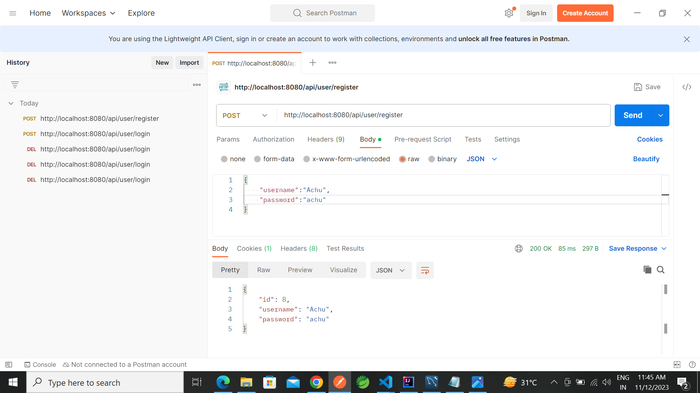
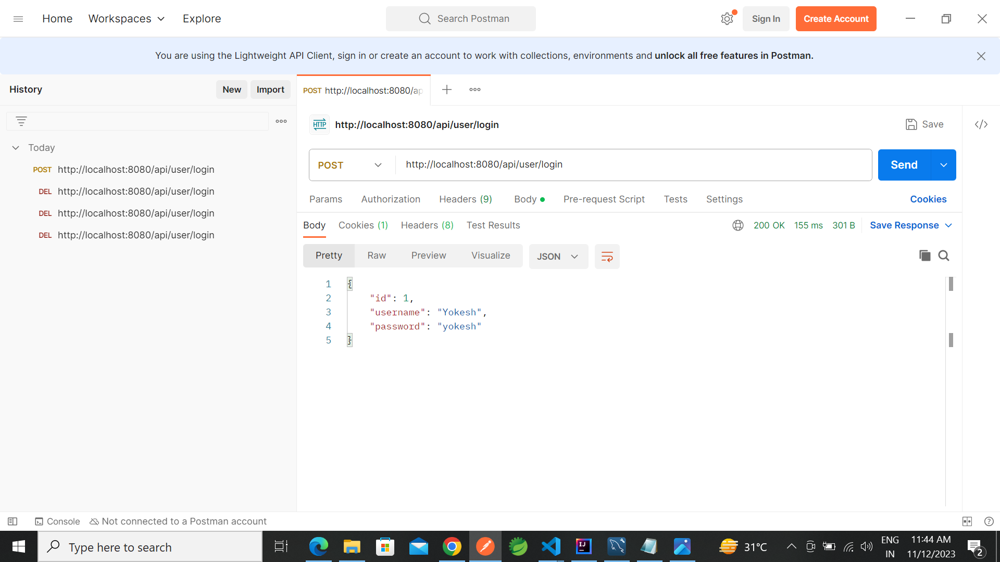
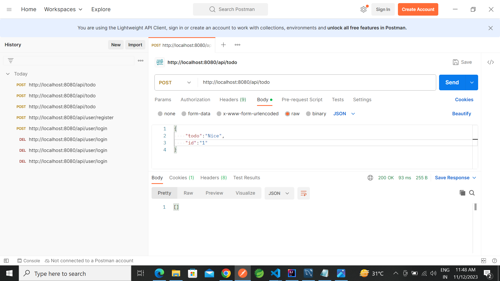
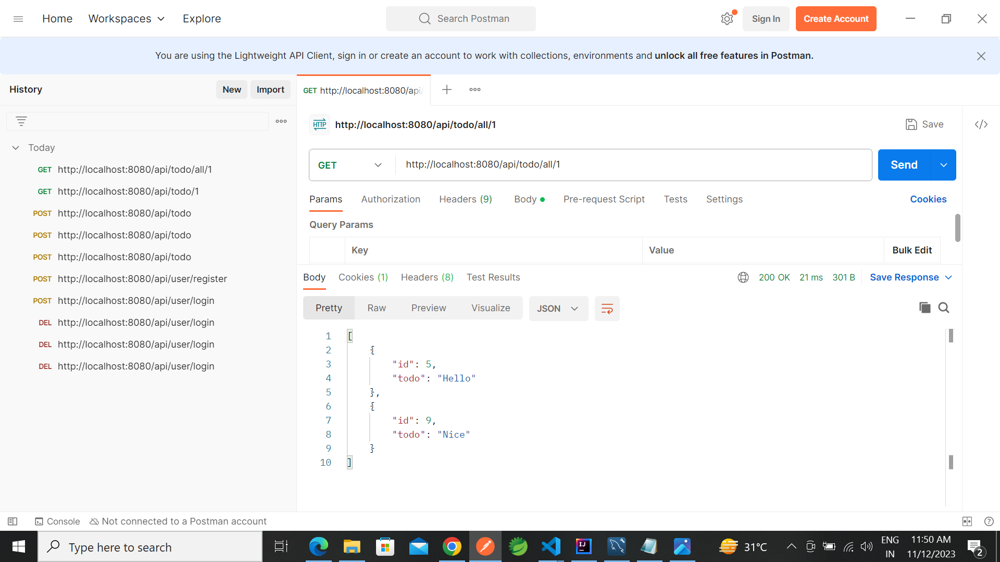
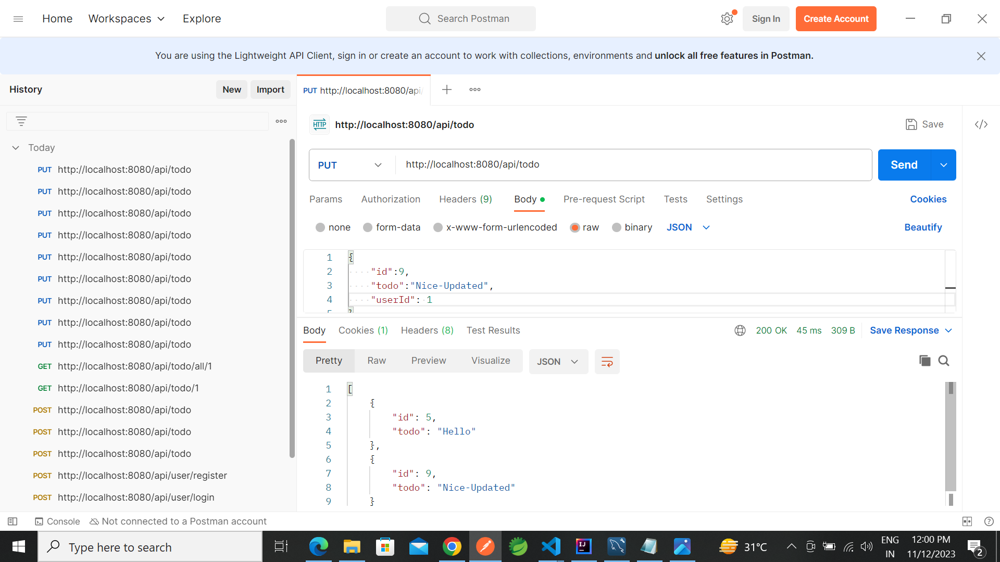
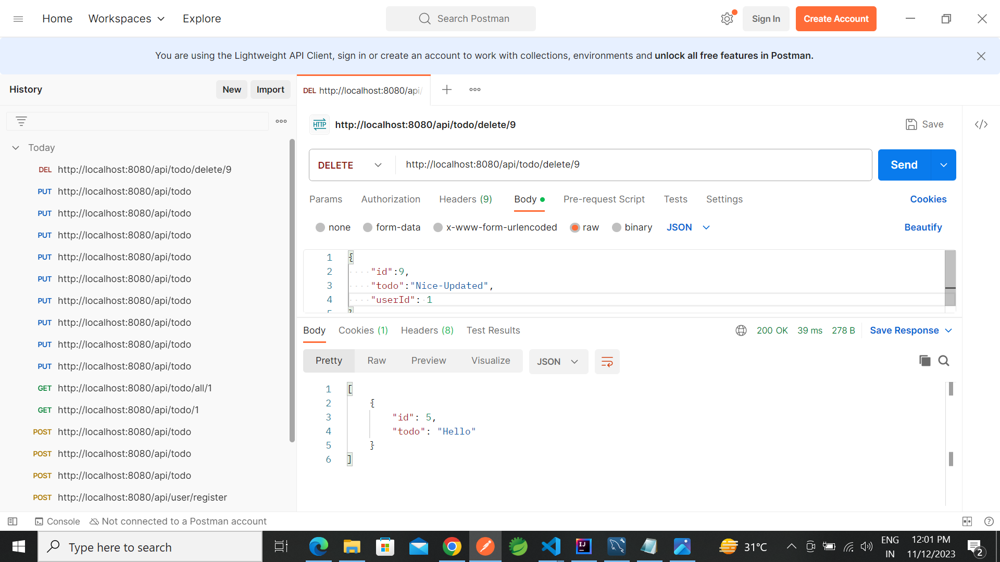

# Todo using springboot for each users
Developed SpringBoot application to create the rest API.

## Description

- Using Postman we can able to do CRUD operation which reflects in database for particular users.

## 🛠 Technology used

- Springboot - 2.7.17
- JDBC
- MySQL

## 🛠 Tools used

- IntelliJ
- MySQL Workbench
- Postman

## 🔲 Architecture

- Controller

        1. Todo Controller
        2. User Controller

- Model

        1. Todo
        2. AppUser

- Repository

        1. Todo Repository
        2. User Repository

- Request

        1. Todo Request

- Service

        1. Todo Service
        2. User Service

## 🔃Working of project

- application.properties

        - Here we have wrote workbence connectivity details.

- Application

        - Here where the application starts running.
        - Once compiled we  will get the port number like(8080) where we can use it to do CRUD operations.

- Todo, AppUser

        - I have created this for model which should be same as the column in the database.

- Todo Repository, User Repository

        - Here i have written the code to play with the database.

- Todo Controller, User Controller

        - Have where the business logic takes place.
        - We would have used annotations here which has been described below.

- Todo Service, User Service

        - Here we will get the object for the Repository class and we will perform CRUD operations.
## Annotations used

        @SpringBootApplication
        @Override
        @CrossOrigin
        @Repository
        @Service
        @Autowired
        @RestController
        @RequestMapping
        @GetMapping
        @PostMapping
        @PutMapping
        @DeleteMapping
        @Entity
        @Getter
        @Setter
        @NoArgsConstructor
        @AllArgsConstructor
        @Table
        @Id
        @GeneratedValue
        @JsonIgnore
        @OneToMany
        @ManyToOne
        @JoinColumn

## Screenshots

1. Register

2. Login
   

3. Create
   

4. Read
   

5. Update
   

6. Delete
   